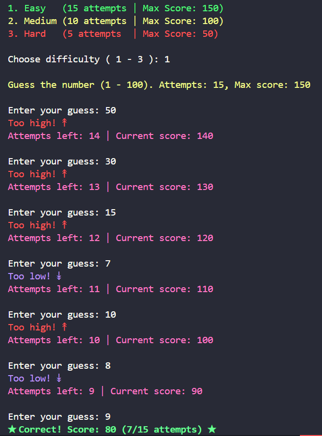

# 🔢 Number Guessing Game with Difficulty Levels

A CLI-based number guessing game with variable difficulty settings and dynamic scoring.



## 🎮 Features
- **3 Difficulty Levels**: Easy (15 attempts), Medium (10), Hard (5)
- Dynamic scoring system (Max 150/100/50 points)
- Color-coded feedback (high/low hints)
- Attempt counter and score tracker
- Input validation for numbers only

## 🛠️ Technologies
- Python 3.x
- `colorama` library (colored terminal output)

## 🚀 How to Play
```bash
python number_guess.py
```

## ⚙️ Installation
```bash
git clone https://github.com/Parsa-developer/Number-Guess.git
cd number-guess-game
pip install -r requirements.txt
```